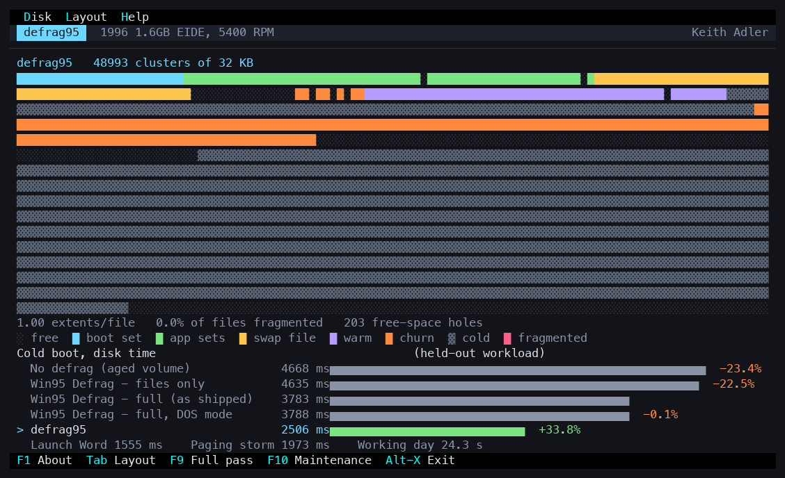
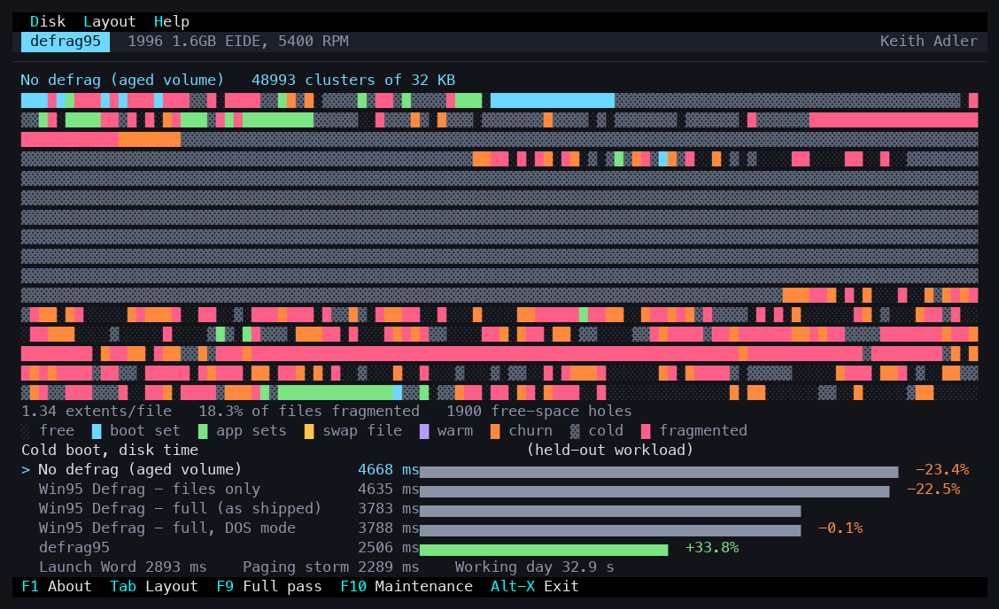
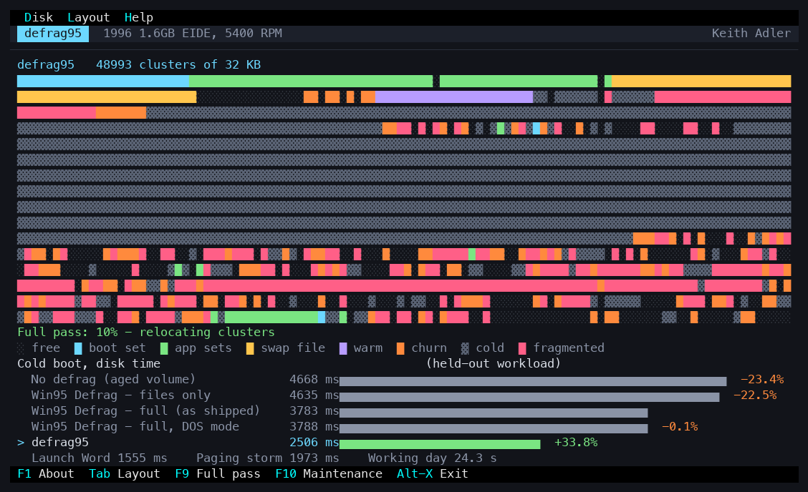
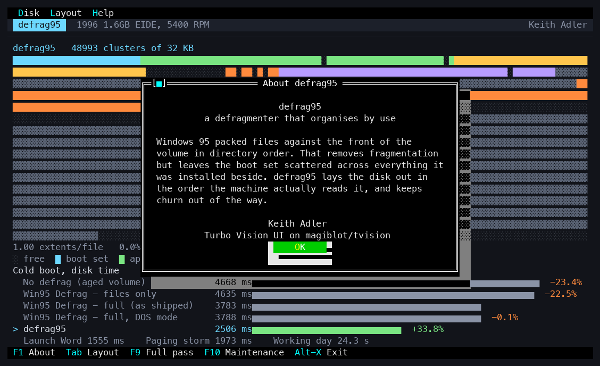

# defrag95

[](https://github.com/keithadler/defrag95/actions/workflows/ci.yml)
[](LICENSE)
[](https://www.python.org/)
[](#running-it)

A defragmenter Windows 95 could have shipped, and a simulation that measures
what it would have been worth.



Windows 95's Disk Defragmenter made files contiguous and packed them against
the front of the volume in directory order. That is a reasonable thing to do
if fragmentation is the problem. On a machine that boots the same 180-odd
files in the same order every morning, fragmentation is only part of the
problem: the boot set is still spread across a gigabyte of disk, because it
was laid out in the order it happened to be *installed*, not the order it is
*read*.

defrag95 lays the volume out by observed use. The measured result, against the
defragmenter that actually shipped, on the same aged volume and a held-out
workload:

| | No defrag | Windows 95 Defrag | defrag95 | defrag95 vs Win95 |
|---|---:|---:|---:|---:|
| Cold boot | 4,668 ms | 3,783 ms | **2,506 ms** | **34% less** |
| Launch Word | 2,893 ms | 2,053 ms | **1,555 ms** | 24% less |
| Paging storm | 2,289 ms | 2,763 ms | **1,973 ms** | 29% less |
| A modelled working day | 32.9 s | 32.2 s | **24.3 s** | 25% less |

The first column is the volume left alone, and it is worth looking at. Over a
whole working day the defragmenter that shipped is **2% better than doing
nothing** — its boot and launch wins are very nearly cancelled by the paging
storm, which it makes 21% *worse*, because it packs every file against the
front of the volume and cannot move the in-use swap file. Against that same
untouched volume defrag95 is 46% faster to boot and 26% better over the day.

Across every drive, fill level and assumption tested, the boot gain ranges
from **14% to 42%**. The full table, with the sensitivity sweep and the
ablation, is in [results/RESULTS.md](results/RESULTS.md) — regenerated from
scratch by `make bench`.

<p align="center"><em>defrag95 — Keith Adler</em></p>

## What it does differently

1. **Order by first access, not by directory.** The boot set is laid down in
   the order the machine reads it, so consecutive reads are consecutive on the
   platter. This is what collapses rotational latency: the drive's own
   read-ahead buffer has already fetched the next file before it is asked for.
2. **Hot data on the outer cylinders.** A 1996 drive streams about 1.7x faster
   at the outer edge than the inner. The boot and application sets go there;
   the help files, clip art and archives go to the slow edge.
3. **Application sets are grouped and ordered**, hottest application first.
4. **The paging file is made contiguous** and parked next to the code that
   pages against it. Windows 95's defragmenter could not touch the swap file
   at all while Windows was running, and on the aged test volume it is in 197
   pieces.
5. **Churn gets its own arena.** Temp files and the browser cache are the
   files that scatter a volume; they are placed together, with headroom, so
   they stop shredding everything around them.
6. **Growth headroom** after files the monitor has seen being rewritten.
7. **A maintenance pass**, not just a full one: files that are still
   contiguous and still near where they belong are left alone. Restoring the
   layout after 90 days of use moves 204 MB rather than the 1,077 MB a full
   pass moves.

Point 1 does most of the work. The ablation table says so plainly, and so does
this repository: with ordering turned off, the gain over the shipped
defragmenter falls from 34% to 3%.

## Is this fair to Windows 95?

It tries hard to be, because a benchmark that flatters its author is worthless.

* Both defragmenters run on the **same aged volume**, from the same seed.
* Both are scored on **held-out workloads** the layout planner never saw. The
  planner gets a 14-day usage log — the kind of thing Windows 98 later shipped
  as Task Monitor — and is then measured on five independent draws with
  different drivers, DLLs, documents and orderings.
* Every layout is charged for **exactly the same bytes off the platter**;
  there is a test that asserts it.
* Windows 95's defragmenter is modelled in three modes, including a DOS-mode
  run where it *can* move the swap file — its best case.
* Both defragmenters get the same maintenance-pass machinery.
* A control layout that packs every file contiguously in **random order**
  performs like Windows 95's, not like defrag95: the win is the ordering, not
  the packing. That is also a test.

## Running it

```bash
make bench     # full benchmark + sensitivity sweep, writes results/ (~15 s)
make test      # 42 checks on the model and the claims
make ui        # build the Turbo Vision front end
make run       # look at the cluster maps
```

Python 3.9+, no third-party packages. The UI needs a C++17 compiler and
ncurses; `make ui` fetches and builds
[magiblot/tvision](https://github.com/magiblot/tvision) into `ui/third_party/`
by itself.

## The UI

A Turbo Vision application, in the spirit of the tools that shipped on these
machines, but with 24-bit colour, Unicode and a mouse. It shows the cluster
map for each layout, animates a pass, and puts the boot-time comparison
underneath.

### The same volume, before and after

A year-old volume, untouched. Pink is fragmented, grey is cold, and the boot
set is the scattered blue — spread across the whole platter:



The same volume after defrag95: the boot set (blue) in read order on the outer
cylinders, application sets (green) behind it, the paging file (yellow) in one
piece next to them, churn (orange) fenced off in its own arena, and everything
never touched (grey) exiled to the slow edge.


A pass in progress — the reorganised region above, the mess still to be dealt
with below:






## Layout of the repository

| | |
|---|---|
| `sim/drive.py` | seek, rotation, zoned transfer, on-drive read-ahead |
| `sim/filesystem.py` | FAT16 volume, VFAT's next-fit allocator, extents |
| `sim/image.py` | builds a Windows 95 install, then ages it a year |
| `sim/workload.py` | boot, launch, document, browsing and paging traces |
| `sim/layouts.py` | the layout policies, including defrag95 |
| `sim/engine.py` | replays a trace and charges it to the drive |
| `sim/bench.py` | the experiment, the ablation, the sensitivity sweep |
| `ui/` | the Turbo Vision front end |
| `docs/DESIGN.md` | how defrag95 would have been built in 1995 |
| `docs/METHODOLOGY.md` | the model, its parameters, and where it is wrong |

## Contributing

The most useful contribution to a project like this is an attack on it: an
assumption that flatters defrag95, an unfair comparison, a workload chosen for
convenience. [CONTRIBUTING.md](CONTRIBUTING.md) sets out the ground rules —
chiefly that any change moving the numbers has to report them before and after,
and that the layout planner must never see the evaluation workload.

MIT licensed. See [LICENSE](LICENSE), and
[CODE_OF_CONDUCT.md](CODE_OF_CONDUCT.md).

## What this is not

This is a simulation, not a defragmenter you can point at a real disk. The
drive model is built from representative period specifications rather than
measurements of a particular drive, and the workload is synthetic. The number
that matters is not "34%" to three significant figures; it is that ordering by
observed use beats ordering by directory across every configuration tested,
for a mechanical reason the model makes explicit — seeks and rotations, not
transfer. [docs/METHODOLOGY.md](docs/METHODOLOGY.md) is candid about the rest.
